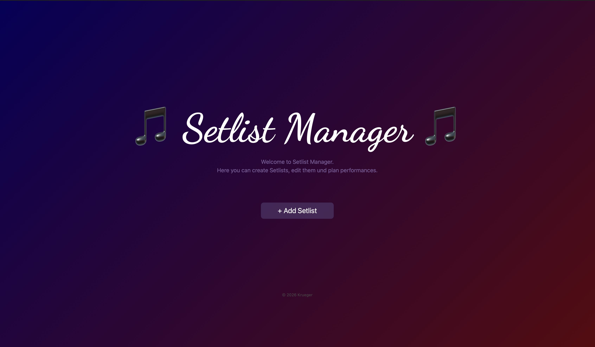
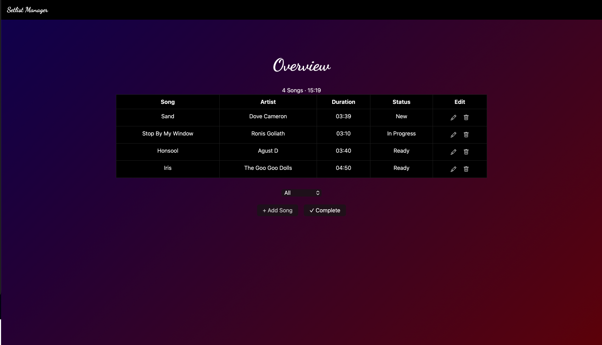
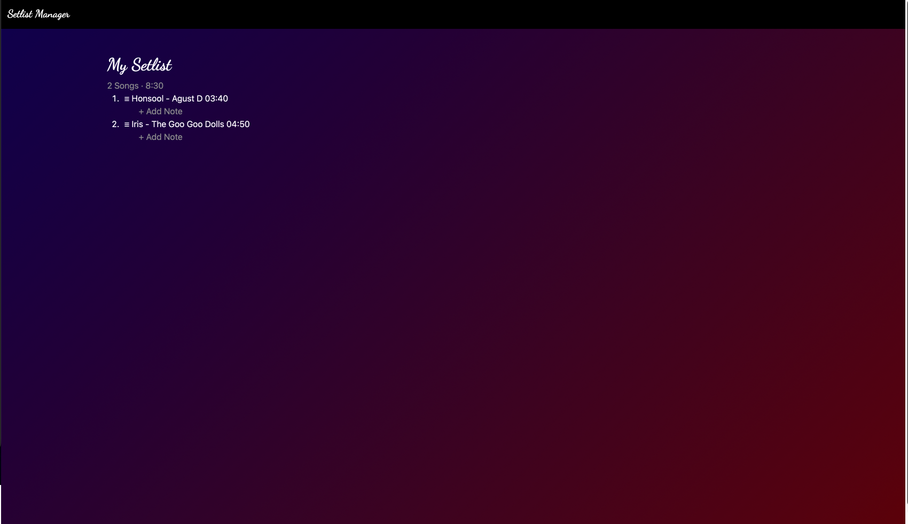
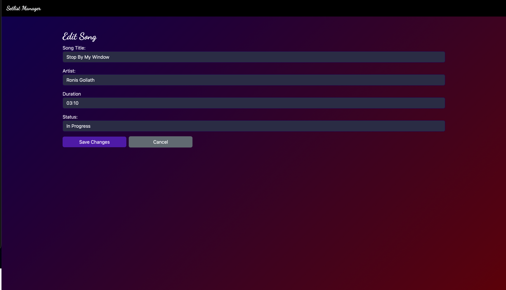

# Setlist Manager - Frontend

Setlist Manager ist eine Platform zur Erstellung und Verwaltung von Setlisten für Musiker, Bands und DJs zum Planen von beispielsweise Konzerten. 

Die App bietet an Songs zu einer Liste hinzuzufügen, Songs zu ändern und von der Liste zu löschen. 

Man kann für jeden Song wählen ob er neu, in Arbeit, oder bereit ist.

## Screenshots

### Startseite

### Übersicht aller Songs

### My Setlist

### Song hinzufügen

### Song bearbeiten

## Features

- Songs hinzufügen ( Titel, Künstler und Status)
- Songs bearbeiten und löschen
- Filter nach Status (New, In Progress, Ready)
- Songs mit Status "Ready" erscheinen automatisch in der Setlist
- Reihenfolge der Setlist per Drag & Drop veränderbar
- Notizen zwischen Songs in der Setlist hinterlegen
- Anzeige der Gesamtdauer der Setlist
- Design mit Farbüberlauf

## Installation

- [Git](https://git-scm.com/downloads)
- [Node.js](https://nodejs.org/en/download)
- [Angular CLI](https://angular.dev/installation) 

global installieren:  npm install -g @angular/cli

## Repositories klonen

git clone https://github.com/linskii/setlist-manager-backend.git
git clone https://github.com/linskii/setlist-manager-frontend.git

### Backend starten

cd setlist-manager-backend
npm install

-> erstelle eine .env Datei:
DB_CONNECTION = mongodb+srv://<username>:<passwort>@cluster0.mongodb.net
DATABASE = setlist

zum Starten vom Backend:
node --watch server.js

### Frontend starten

cd setlist-manager-frontend
npm install
ng serve

### Anwendung öffnen

Frontend: [http://localhost:4200](http://localhost:4200)
 > das Backend muss dafür ebenfalls gestartet sein

## Deployment

Das Projekt ist als App erreichbar unter:
https://setlist-manager-frontend-nine.vercel.app 

## Technologien

Frondend: Angular
UI Framework: Bootstrap
Drag&Drop: SortableJS
Backend: Node.js mit Express
Datenbank: MongoDB Atlas
Sprache: TypeScript + JavaScript

## Verwendete KI-Werkzeuge

- Claude (Anthropic): SortableJS (Drag&Drop), Hover, Bootstrap Icons, Technik mit "split(':') und reduce(), @Viewchild, Hilfe beim debugging (z.B.ChangeDetectorRef)
